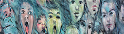

This resource currently contains hundreds of facial images (AI created, real photos, cartoons etc.) with varied emotions (with royalty free usage permit). In addition, the likely "**diagnostic efficiency**" of the images (i.e., potential ability to optimally discriminate between behaviors of individuals with autism or neurotypical development) as predicted by various models of primate vision are also provided here. This is a work in progress and I hope over time, the research community around this will grow to include folks doing clinical/translational work who can test and validate these predictions

## Basic Steps:

Original Image | Resized and SHINED | Aperture placed | Pass through ANN | Predicted Difference
-------------- | ------------------ | --------------- | -----------------| --------------------
||||0.13


## Check-out the image gallery:

[](https://github.com/kohitij-kar/decifer_autism.github.io/blob/392754a3346ffceccbfce07cccb72b2540922abc/_my_collection/image_gallery.md)


# Background: Why does this webpage exist ??

<details>
  <summary>  What is DECIFER Autism? </summary>

</details>
<details>
  <summary>  Main Goal </summary>

</details>

<details>
  <summary>  Scientific Motivation </summary>

</details>

<details>
  <summary>  Working hypothesis and preliminary proof of principle </summary>

</details>

## Current available images and corresponding model predictions
_This will grow over time_

Model Name | Full-set DE score | Optim-set DE score | Download (All) | Download (optimized)
---------- | ----------------- | ------------------ | -------------- | --------------------
AlexNet.    | 0.34 | 0.84 |[Link (_activated upon publication_)](https://github.com/kohitij-kar/decifer_autism.github.io)|[Link(_activated upon publication_)](https://github.com/kohitij-kar/decifer_autism.github.io)
Emotion Net | 0.25 | 0.94 |[Link (_activated upon publication_)](https://github.com/kohitij-kar/decifer_autism.github.io)|[Link(_activated upon publication_)](https://github.com/kohitij-kar/decifer_autism.github.io)
VGG-Face    | 0.32 | 0.88 |[Link(_activated upon publication_)](https://github.com/kohitij-kar/decifer_autism.github.io)|[Link(_activated upon publication_)](https://github.com/kohitij-kar/decifer_autism.github.io)
CORnet-S    | 0.15 | 0.83 |[Link(_activated upon publication_)](https://github.com/kohitij-kar/decifer_autism.github.io)|[Link(_activated upon publication_)](https://github.com/kohitij-kar/decifer_autism.github.io)


```
Future additions coming!

* Morphs between facial emotions of same individuals
* Videos of individuals demonstrating facial emotions
* Predictions from more models
* Neurally regularized model predictions
* Model synthesized images with specific behavioral predictions

```

### Support or Contact

If you have any questions, advice, suggestions, eagerness to collaborate, or want to discuss the science -- related to this line of research, please email me: [Kohitij Kar](mailto:kohitij@mit.edu) (you can refer to me as **Ko** if that is easier)
